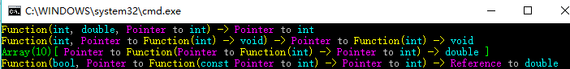

Type analysis template
====================
##Code

**Header file : type_analysis.h**
```c++
#ifndef TYPE_ANALYSIS_H_
#define TYPE_ANALYSIS_H_

#include "gbl/io/color.h"

#include <iosfwd>

namespace type_analysis {

#define RST        gbl::io::format::reset           // reset
#define UNKNOWN(x) gbl::io::hfg::red << x << RST    // unknown type
#define FUNC(x)    gbl::io::hfg::yellow << x << RST // function
#define ARRAY(x)   gbl::io::hfg::green << x << RST  // array
#define TYPE(x)    gbl::io::hfg::cyan << x << RST   // type
#define PR(x)      gbl::io::hfg::purple << x << RST // pointer / reference
#define MOD(x)     gbl::io::hfg::cyan << x << RST   // modifier

template <typename T, typename ...Args>
struct type_of {};

template <typename T>
std::ostream& operator<<(std::ostream& os, type_of<T>) {
  os << UNKNOWN("???");
  return os;
}

template <typename F>
std::ostream& operator<<(std::ostream& os, type_of<F()>) {
  os << FUNC("Function(") << TYPE("void") << FUNC(") -> ") << type_of<F>();
  return os;
}

template <typename F, typename ...Args>
std::ostream& operator<<(std::ostream& os, type_of<F(Args...)>) {
  os << FUNC("Function(") << type_of<Args...>() << FUNC(") -> ") << type_of<F>();
  return os;
}

template <typename Array>
std::ostream& operator<<(std::ostream& os, type_of<Array[]>) {
  os << ARRAY("Array[ ") << type_of<Array>() << ARRAY(" ]");
  return os;
}

template <typename Array, size_t N>
std::ostream& operator<<(std::ostream& os, type_of<Array[N]>) {
  os << ARRAY("Array(") << ARRAY(N) << ARRAY(")[ ") << type_of<Array>() << ARRAY(" ]");
  return os;
}

template <typename First, typename ...Args> 
std::ostream& operator<<(std::ostream& os, type_of<First, Args...>) { 
  os << type_of<First>() << ", " << type_of<Args...>();
  return os; 
}

template <typename Ref>
std::ostream& operator<<(std::ostream& os, type_of<Ref&>) {
  os << PR("Reference ") << "to " << type_of<Ref>();
  return os;
}

template <typename Ref>
std::ostream& operator<<(std::ostream& os, type_of<const Ref&>) {
  os << MOD("const ") << PR("Reference ") << "to " << type_of<Ref>();
  return os;
}

template <typename Ptr>
std::ostream& operator<<(std::ostream& os, type_of<Ptr*>) {
  os << PR("Pointer ") << "to " << type_of<Ptr>();
  return os;
}

template <typename Ptr>
std::ostream& operator<<(std::ostream& os, type_of<const Ptr*>) {
  os << MOD("const ") << PR("Pointer ") << "to " << type_of<Ptr>();
  return os;
}

template <typename Ptr>
std::ostream& operator<<(std::ostream& os, type_of<volatile Ptr*>) {
  os << PR("Pointer ") << "to " << MOD("volatile") << type_of<Ptr>();
  return os;
}

template <typename T>
std::ostream& operator<<(std::ostream& os, type_of<volatile T>) {
  os << MOD("volatile") << type_of<T>();
  return os;
}

template <typename T>
std::ostream& operator<<(std::ostream& os, type_of<const T>) {
  os << MOD("const") << type_of<T>();
  return os;
}

template <>
std::ostream& operator<<(std::ostream& os, type_of<void>) {
  os << TYPE("void");
  return os;
}

template <>
std::ostream& operator<<(std::ostream& os, type_of<bool>) {
  os << TYPE("bool");
  return os;
}

template <>
std::ostream& operator<<(std::ostream& os, type_of<char>) {
  os << TYPE("char");
  return os;
}

template <>
std::ostream& operator<<(std::ostream& os, type_of<signed char>) {
  os << TYPE("signed char");
  return os;
}

template <>
std::ostream& operator<<(std::ostream& os, type_of<unsigned char>) {
  os << TYPE("unsigned char");
  return os;
}

template <>
std::ostream& operator<<(std::ostream& os, type_of<char16_t>) {
  os << TYPE("char16_t");
  return os;
}

template <>
std::ostream& operator<<(std::ostream& os, type_of<char32_t>) {
  os << TYPE("char32_t");
  return os;
}

template <>
std::ostream& operator<<(std::ostream& os, type_of<wchar_t>) {
  os << TYPE("wchar_t");
  return os;
}

template <>
std::ostream& operator<<(std::ostream& os, type_of<short>) {
  os << TYPE("short");
  return os;
}

template <>
std::ostream& operator<<(std::ostream& os, type_of<unsigned short>) {
  os << TYPE("unsigned short");
  return os;
}

template <>
std::ostream& operator<<(std::ostream& os, type_of<int>) {
  os << TYPE("int");
  return os;
}

template <>
std::ostream& operator<<(std::ostream& os, type_of<unsigned int>) {
  os << TYPE("unsigned int");
  return os;
}

template <>
std::ostream& operator<<(std::ostream& os, type_of<long>) {
  os << TYPE("long");
  return os;
}

template <>
std::ostream& operator<<(std::ostream& os, type_of<unsigned long>) {
  os << TYPE("unsigned long");
  return os;
}

template <>
std::ostream& operator<<(std::ostream& os, type_of<long long>) {
  os << TYPE("long long");
  return os;
}

template <>
std::ostream& operator<<(std::ostream& os, type_of<unsigned long long>) {
  os << TYPE("unsigned long long");
  return os;
}

template <>
std::ostream& operator<<(std::ostream& os, type_of<float>) {
  os << TYPE("float");
  return os;
}

template <>
std::ostream& operator<<(std::ostream& os, type_of<double>) {
  os << TYPE("double");
  return os;
}

template <>
std::ostream& operator<<(std::ostream& os, type_of<long double>) {
  os << TYPE("long double");
  return os;
}

#undef RST
#undef UNKNOWN
#undef FUNCTION
#undef ARRAY
#undef TYPE
#undef PR
#undef MOD

} // namespace type_analysis
#endif
```

**Source file : test.cpp**
```c++
#include <iostream>

#include "type_analysis.h"

using namespace type_analysis;

int main() {
  std::cout << type_of<int*(int, double, int[])>() << "\n";
  std::cout << type_of<void(*(int, void(*)(int)))(int)>() << "\n";
  std::cout << type_of<double(*[10])(int*(int))>() << "\n";
  std::cout << type_of<double&(bool, int*(const int*))>() << "\n";
}
```

##Effect

